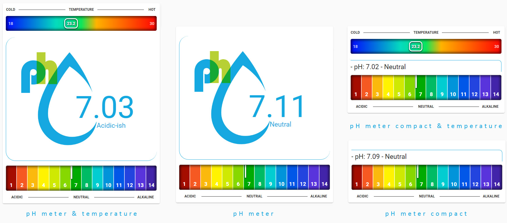
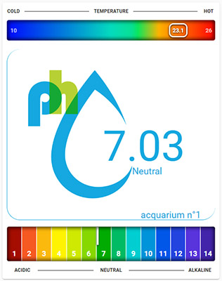

# pH-meter-Temperature
ph meter & temperature for aquarium


[](https://www.buymeacoffee.com/madmicio)





## hacs Card install
1. add madmicio/pH-meter-Temperature as custom reposity

2. Find and install `pH-meter-Temperature` plugin

3. Add a reference  inside your resources config:

  ```yaml
resources:
url: /hacsfiles/ph-meter-temperature/ph_meter.js
type: module
```


### Manual install

1. Download and copy `ph_meter.js` from (https://github.com/madmicio/pH-meter-Temperature) into your custom components  directory.

2. Add a reference `ph_meter.js` inside your resources config:

  ```yaml
  resources:
    - url: /local/"your_directory"/ph_meter.js
      type: module
  ```
### lovelace full config (ph meter & temperature):
```yaml
type: 'custom:ph-meter'
entity: sensor.ph_sensor
temperature: sensor.temperatura_acquario
ph_state: sensor.ph_state
```

### lovelace no temperature config (ph meter):
```yaml
type: 'custom:ph-meter'
entity: sensor.ph_sensor
ph_state: sensor.ph_state
```

### lovelace compact config ph meter compact):
```yaml
type: 'custom:ph-meter'
entity: sensor.ph_sensor
ph_state: sensor.ph_state
compact: true
```
### lovelace compact config ph meter compact & temperature):
```yaml
type: 'custom:ph-meter'
entity: sensor.ph_sensor
temperature: sensor.temperatura_acquario
ph_state: sensor.ph_state
compact: true
```

### Main Options
| Name | Type | Default | Supported options | Description |
| -------------- | ----------- | ------------ | ------------------------------------------------ | --------------------------------------------------------------------------------------------------------------------------------------------------------------------------------------------------------------------------------------------------------------------------------------------------------------------------------------------- |
| `type` | string | **Required** | type: 'custom:ph-meter' | Type of the card |
| `entity` | string | **Required** |  | ph sensor entity |
| `name` | string | **Option** |  | aquarium name |
| `temperature` | string | **Option** |  | temperature sensor entity |
| `ph_state` | string | **Option** |  | ph state sensor entity |
| `temp_min` | number | "18" |  | minimum temperature of the thermometer range |
| `temp_max` | number | "30" |  | maximun temperature of the thermometer range |
| `temp_min_range_ok` | number | "22" |  | minimum temperature of the comfort zone range. (green area of the gradient) |
| `temp_max_range_ok` | number | "24" |  | maximum temperature of the comfort zone range. (green area of the gradient) |


### custom config + acquarium name:



```yaml
type: 'custom:ph-meter'
entity: sensor.ph_sensor
temperature: sensor.temperatura_acquario
name: acquarium n°1
ph_state: sensor.ph_state
temp_min: "10"
temp_max: "26"
temp_min_range_ok: "18"
temp_max_range_ok: "20"
```
